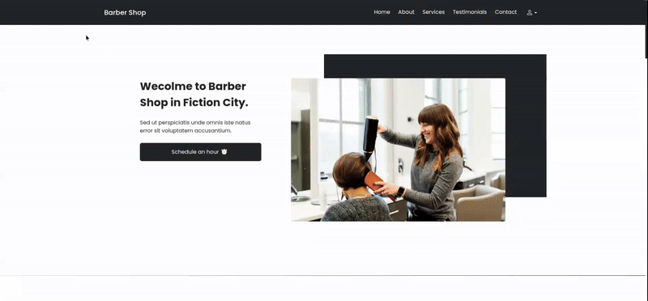

<h1 align="center">Barbershop</h1>

  Um projeto completo de barbearia, com foco em demonstrar habilidades em front e back-end.

  <a href="#tecnologias">Tecnologias</a>&nbsp;&nbsp;&nbsp;|&nbsp;&nbsp;&nbsp;
  <a href="#projeto">Projeto</a>&nbsp;&nbsp;&nbsp;|&nbsp;&nbsp;&nbsp;
  <a href="#orientações">Orientações</a>&nbsp;&nbsp;&nbsp;|&nbsp;&nbsp;&nbsp;
  <a href="#desafios">Desafios</a>&nbsp;&nbsp;&nbsp;|&nbsp;&nbsp;&nbsp;
  <a href="#extras">Extras</a>&nbsp;&nbsp;&nbsp;|&nbsp;&nbsp;&nbsp;
  <a href="#memo-licença">Licença</a>

  

 

  

<h2> 🚀 Tecnologias </h2>

Este projeto foi desenvolvido com:

<h3> Frontend </h3>

    🎨 Vue.js 3 — framework reativo para construção da interface

    🟦 TypeScript — tipagem estática e maior segurança no código

    🧪 VeeValidate + Yup — validação de formulários e schemas

    📅 Vue DatePicker (@vuepic/vue-datepicker) — seleção personalizada de datas

    🧩 Axios — comunicação entre frontend e API

    🎛️ Bootstrap 5 — estilização, layout responsivo e componentes UI

<h3> Backend </h3>

    🐘 Laravel — estrutura robusta para API REST

    🗄️ MySQL — banco de dados relacional

<h3> Infraestrutura / DevOps </h3>

    🐳 Docker & Docker Compose — containerização do ambiente completo

    📦 Composer / NPM — gerenciamento de dependências backend e frontend

<h3> Outras Ferramentas </h3>

    🍬 SweetAlert2 — alertas e feedbacks visuais

    📏 Yup — validações complexas baseadas em schema

## 💻 Projeto

Este projeto é um sistema completo de agendamento para barbearias, desenvolvido para facilitar tanto a experiência do cliente quanto o gerenciamento do barbeiro.

Os usuários podem criar, visualizar e editar seus agendamentos de forma simples e intuitiva. O sistema conta também com um painel administrativo destinado ao barbeiro, onde é possível:

    📅 Cadastrar e gerenciar horários disponíveis

    💈 Criar, editar e remover serviços oferecidos

    👤 Visualizar todos os agendamentos registrados

    📊 Acessar um dashboard com métricas importantes, como faturamento e quantidade de atendimentos

    ⚙️ Controlar a agenda de forma organizada e eficiente

  O objetivo principal do projeto é oferecer uma solução moderna, responsiva e fácil de utilizar, conectando clientes ao serviço de barbearia com praticidade e controle total.

## 🗺️ Orientações

Certifique-se de ter o Docker instalado antes de iniciar.

## ⚔️ Desafios enfrentados

Durante o desenvolvimento, enfrentei desafios relacionados tanto ao ambiente quanto à lógica do projeto. Trabalhar com várias ferramentas em conjunto exigiu bastante atenção para entender como tudo se integra. A configuração do Docker e a organização do ambiente de desenvolvimento foram etapas que demandaram tempo e cuidado.

Outro desafio constante foi lidar com a complexidade do código ao combinar Vue 3, TypeScript e VeeValidate, especialmente em cenários de validação, manipulação de datas e atualização dinâmica de componentes. A lógica de negócio também apresentou situações desafiadoras, que exigiram repensar abordagens, revisar fluxos e aprimorar decisões técnicas.

Apesar disso, cada obstáculo contribuiu para um aprendizado sólido e uma evolução significativa no domínio dessas ferramentas.

## ➕ Extras

Fique à vontade para explorar ou se inspirar.