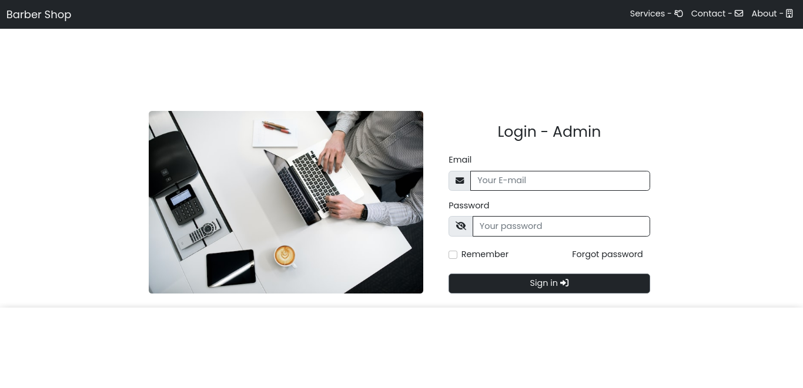

<h1 align="center"> Barber Shop </h1>

  Projeto com intuito de ser desenvolvido como trabalho para a escola, entretanto foi decidido por mim que ele seria aprofundado em seu desenvolvimento.

  <a href="#tecnologies">Tecnologias</a>&nbsp;&nbsp;&nbsp;|&nbsp;&nbsp;&nbsp;
  <a href="#project">Projeto</a>&nbsp;&nbsp;&nbsp;|&nbsp;&nbsp;&nbsp;
    <a href="#orientações">Orientações</a>&nbsp;&nbsp;&nbsp;|&nbsp;&nbsp;&nbsp;
  <a href="#desafios">Desafios</a>&nbsp;&nbsp;&nbsp;|&nbsp;&nbsp;&nbsp;
  <a href="#extres">Extras</a>&nbsp;&nbsp;&nbsp;|&nbsp;&nbsp;&nbsp;
  <a href="#memo-licença">Licença</a>

  

 

  

## 🚀 Tecnologias

 Esse projeto foi desenvolvido com as seguintes tecnologias: 

- HTML e CSS (Bootstrap 5);
- JavaScript e Axios;
- PHP;
- [Latte (Sistema de template)](https://latte.nette.org/en/);
- [Vite](https://vitejs.dev/);
- NPM e Composer.

## 💻 Projeto

 O "Barber Shop" foi um projeto desenvolvido com o objetivo inicial de aprender a utilizar o framework Bootstrap e a arquitetura MVC na prática, entretanto, com o passar do tempo, decidi ir a fundo e implementar funcionalidades que estão presentes em muitos sites hoje em dia, alguns exemplos são: 

  <ul style="margin-left: 20px;">
      <li> Função para ver senha; </li>
      <li> Função para lembrar de usuário; </li>
      <li> Upload de imagem para perfil; </li>
      <li> Envio de e-mail com PHPMailer; </li>
      <li> Envio de e-mail para recuperação de senha com PHPMailer. </li>
  </ul>

## 🗺️ Orientações

 Você precisa ter NPM, Composer e MySQL instalados em sua máquina. 

<ul style="margin-left: 20px" id="orientations">
  <li> Rode em seu terminal o comando npm install e composer install para instalar as depedências do projeto;</li>
      <li> Crie um banco de dados com as seguintes tabelas:
      <li style="margin-left: 30px"> Tabela admin com os campos: id, photo, name, email e password;  </li>
      <li style="margin-left: 30px"> Tabela clients com os campos: id, name, payment, date e schedule; </li>
      <li style="margin-left: 30px"> Tabela hours com os campos: id e hours; </li>
      <li style="margin-left: 30px"> Tabela payment com os campos: id e name; </li>
      <li style="margin-left: 30px"> Tabela reset (resetar senha) com os campos: id, user_id, token e time (para armazenar data e horário). </li>
  </li>
</ul>

## ⚔️ Desafios enfrentados

  Houve diversos desafios que ocorreram durante a produção deste projeto, trabalhar com JS e PHP juntos foram um deles, principalmente na hora de deixar diversas funcionalidades encontradas no site assíncronas. Aplicar pela primeira vez o sistema de template Latte também não foi uma tarefa tão simples. 

## 🧑‍🔧 Extras

 
  Algumas Melhorias que devem ser feitas por eu ou até mesmo por você caso queira no futuro:

  <ul style="margin-left: 20px">
      <li> Deixar algumas funcionalides assíncronas, como por exemplo o "Upload de foto" no painel Admin; </li>
      <li> Realizar mudanças essenciais no código; </li>
      <li> Melhorar a estrutura do banco de dados; </li>
      <li> Implementar métodos de pagamento. </li>
  </ul>

<ul style="margin-left: 20px" id="orientations">
    
</ul>

## :memo: Licença

Esse projeto está sob a licença MIT.